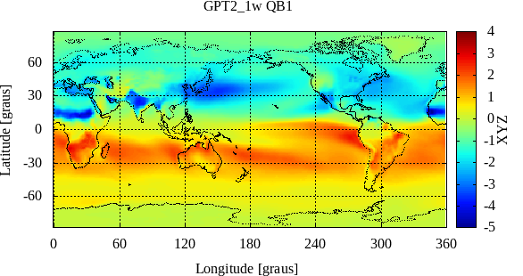
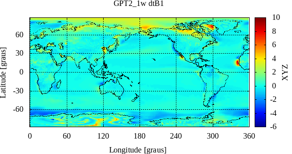
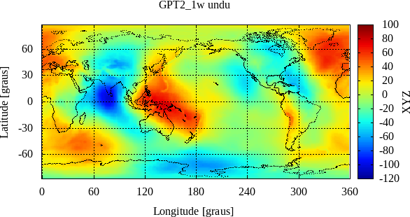
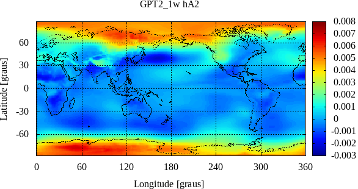
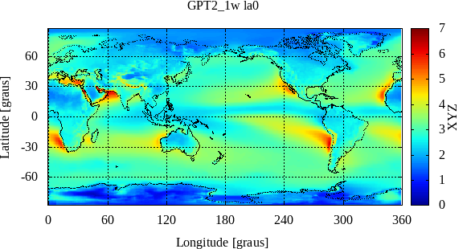
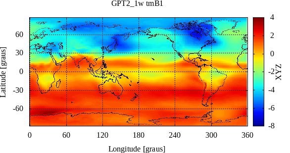

Here some images are placed - For all images, the color bar is autoscaled
```
c%
c% This subroutine determines pressure, temperature, temperature lapse rate, 
c% mean temperature of the water vapor, water vapor pressure, hydrostatic 
c% and wet mapping function coefficients ah and aw, water vapour decrease
c% factor and geoid undulation for specific sites near the Earth surface.
c% It is based on a 1 x 1 degree external grid file ('gpt2_1wA.grd') with mean
c% values as well as sine and cosine amplitudes for the annual and
c% semiannual variation of the coefficients.
c% p:    pressure in hPa (vector of length nstat) 
c% T:    temperature in degrees Celsius (vector of length nstat)
c% dT:   temperature lapse rate in degrees per km (vector of length nstat)
c% Tm:   mean temperature of the water vapor in degrees Kelvin (vector of length nstat)
c% e:    water vapor pressure in hPa (vector of length nstat)
c% ah:   hydrostatic mapping function coefficient at zero height (VMF1) 
c%       (vector of length nstat)
c% aw:   wet mapping function coefficient (VMF1) (vector of length nstat)
c% la:   water vapor decrease factor (vector of length nstat)
c% undu: geoid undulation in m (vector of length nstat)
Source: https://vmf.geo.tuwien.ac.at/codes/gpt2_1w.f
```

The plots below refers to the some parameters provided by using harmonics expressions



















