Here some images are stored

For all images, the color bar is autoscaled and the legend is wrong (XYZ)

```
! p:    pressure in hPa (vector) 
! T:    temperature in degrees Celsius (vector)
! dT:   temperature lapse rate in degrees per km (vector)
! Tm:   mean temperature weighted with the water vapor in degrees Kelvin (vector) 
! e:    water vapour pressure in hPa (vector)
! ah:   hydrostatic mapping function coefficient (VMF3) (vector)
! aw:   wet mapping function coefficient (VMF3) (vector)
! la:   water vapour decrease factor (vector)
! undu: geoid undulation in m (vector)
! Gn_h: hydrostatic north gradient in m (vector)
! Ge_h: hydrostatic east gradient in m (vector)
! Gn_w: wet north gradient in m (vector)
! Ge_w: wet east gradient in m (vector)
!
Source: https://vmf.geo.tuwien.ac.at/codes/gpt3_1.f90
```

The plots below refers to the some parameters provided by using harmonic models

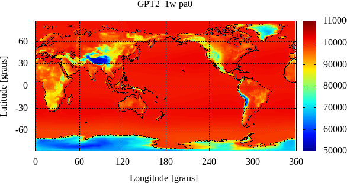
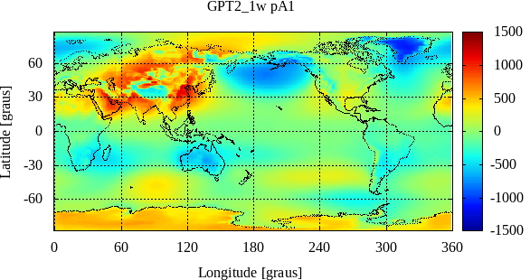
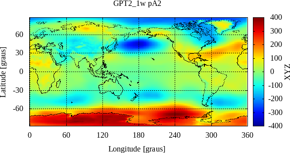
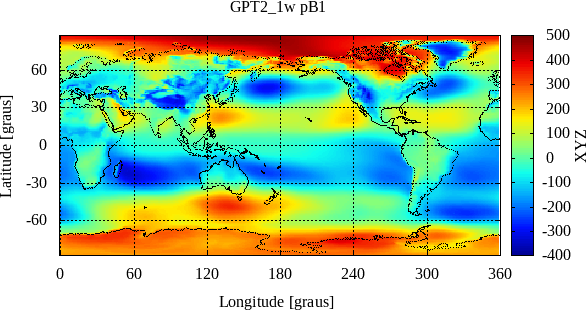
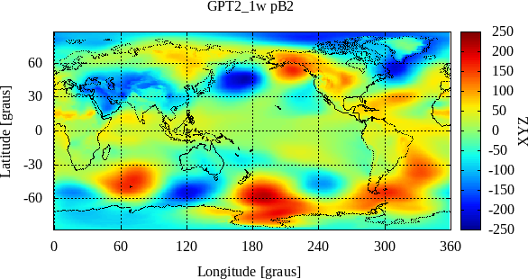

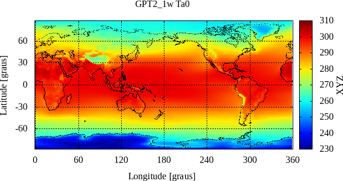
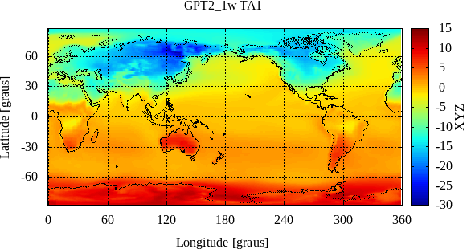
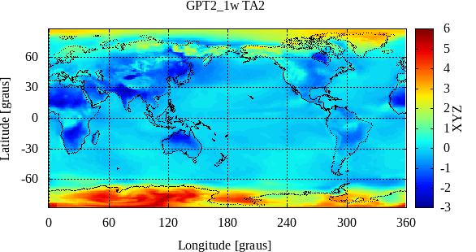


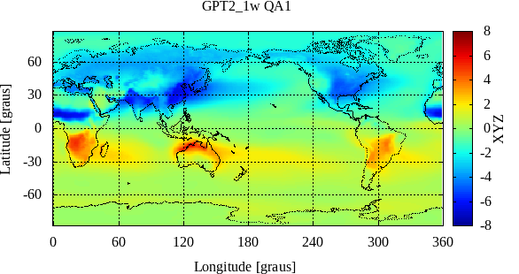

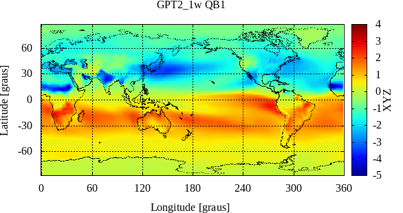


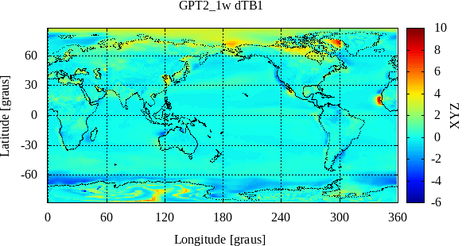
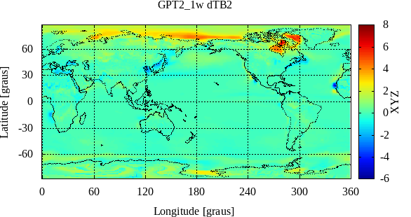

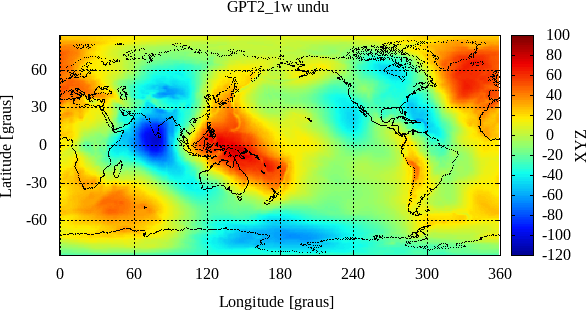
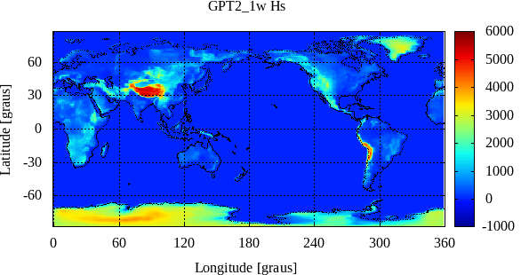

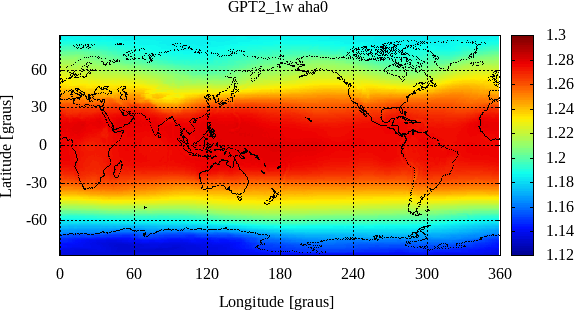
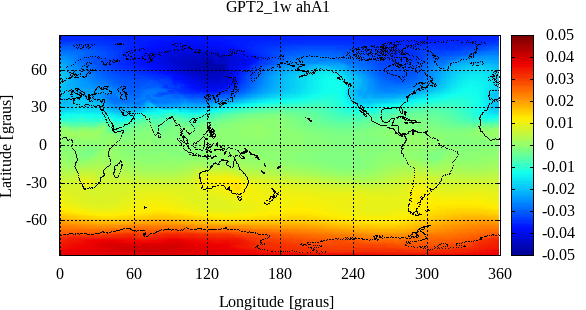

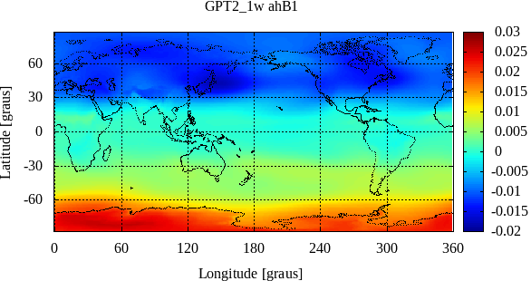


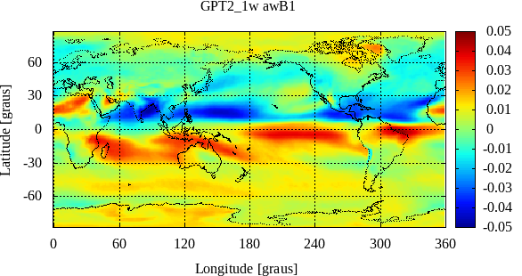


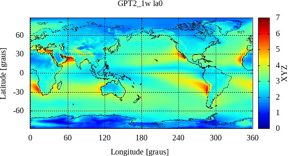
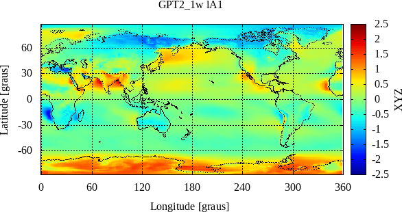

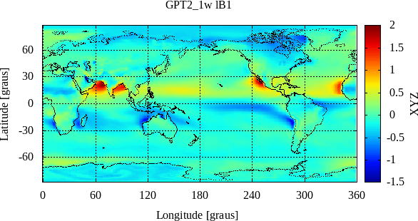


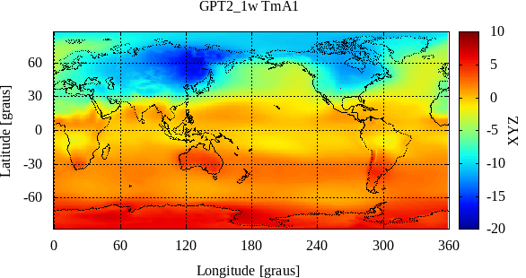
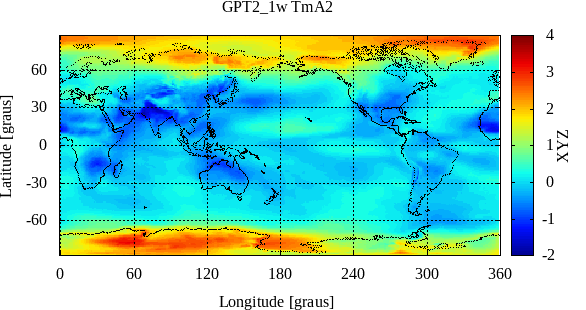
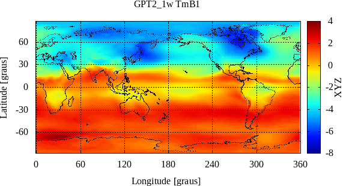
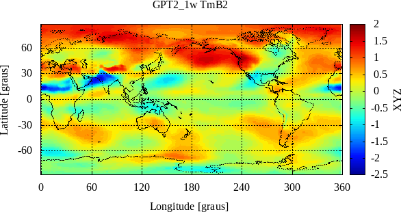

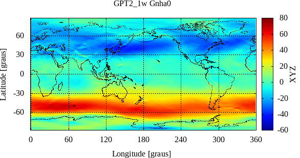

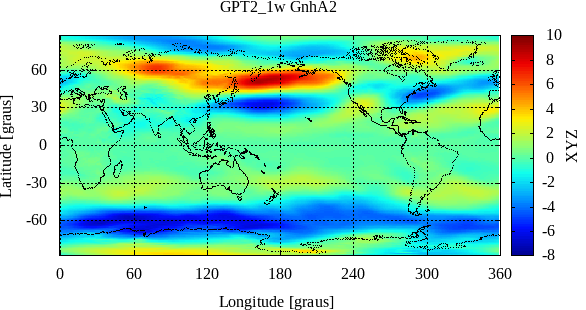
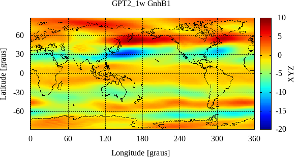
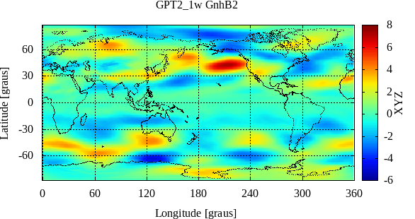

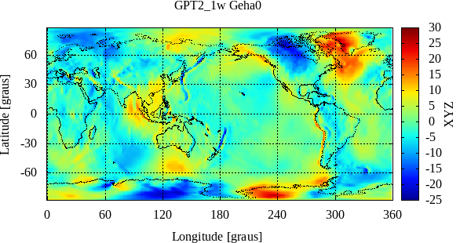
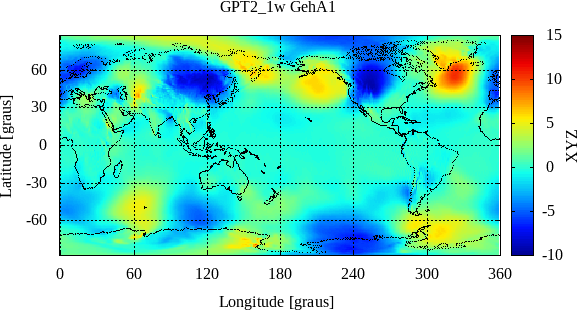


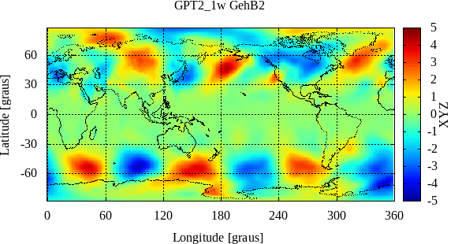

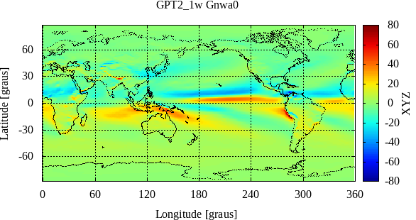
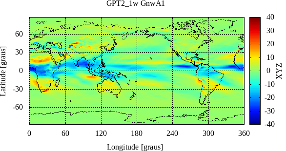


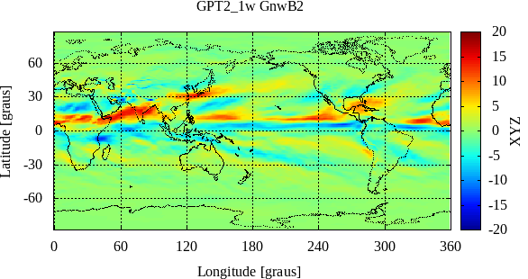

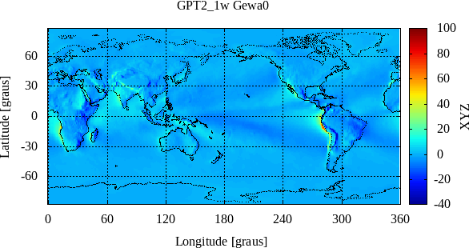
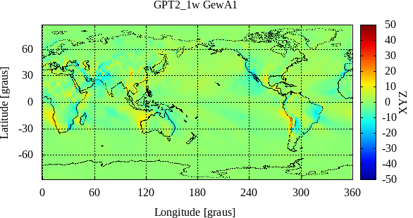
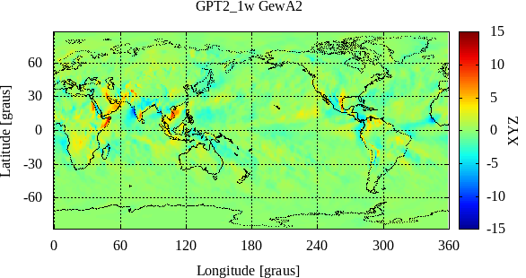


