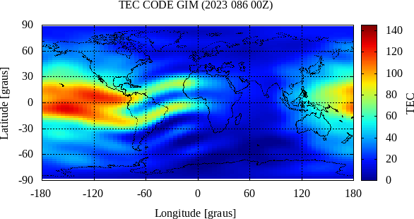
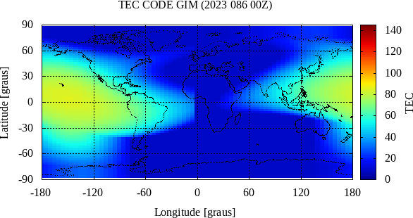

### GIM - Global Ionospheric Model from CODE



### KLOBUCHAR



### NEQUICK


```
#... ....1.... ....2.... ....3.... ....4.... ....5.... ....6.... ....7..
reset; unset key; unset surf; set grid
set terminal gif animate delay 100 nocrop enhanced transparent size 586,310 font "Times,12.0"
set output 'gim_code_202308200_24Z.gif'
set xtics  60; set ytics  30; set mxtics  1; set mytics  1
set grid front mxtics mytics lw 1.0 dt 3 lt 0 lc rgb 'black'
set lmargin 6.65; set rmargin 0.65; set tmargin 1.85; set bmargin 2.85
set xrange[-180.0:180.0]; set yrange[-90.0:90.0]; set cbrange[0.0:145.0]
set xlabel 'Longitude [graus]'; set ylabel 'Latitude [graus]'

set palette defined ( 0 "#000090", 1 "#000fff", 2 "#0090ff",\
                      3 "#0fffee", 4 "#90ff70", 5 "#ffee00",\
                      6 "#ff7000", 7 "#ee0000", 8 "#7f0000")

do for [i=0:24] {
  set title sprintf("TEC CODE GIM (2023 086 %02.0fZ)", i); set cblabel 'TEC'
  plot sprintf("./%02.0f.map", i) matrix using (-180.0+$1*5):(87.5-$2*2.5):($3/10.0) \
     with image, 'world_110m.txt' with dots linestyle 1 linecolor -1
}

unset output
exit 1;
```
