Some Leica Geosystems models given in the ATX file igs20_2247.atx

Raw values, no interpolation applied

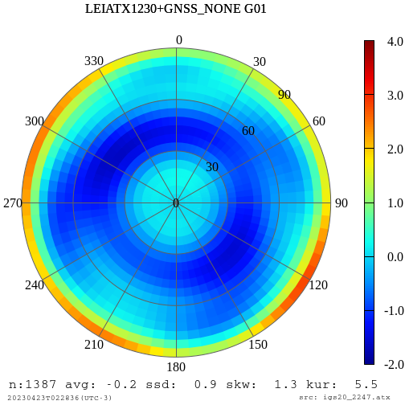
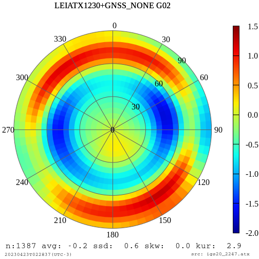
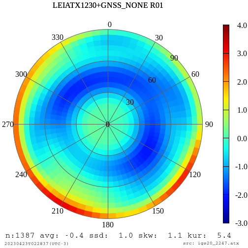
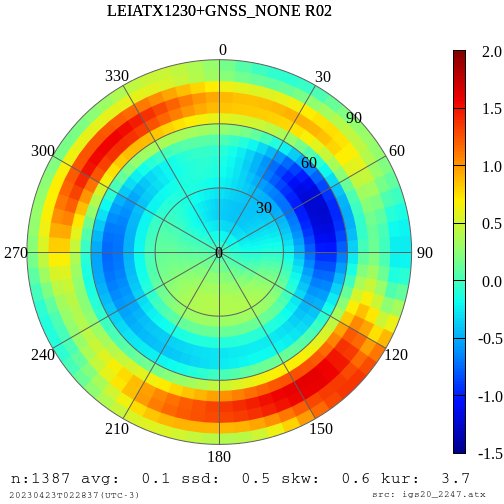
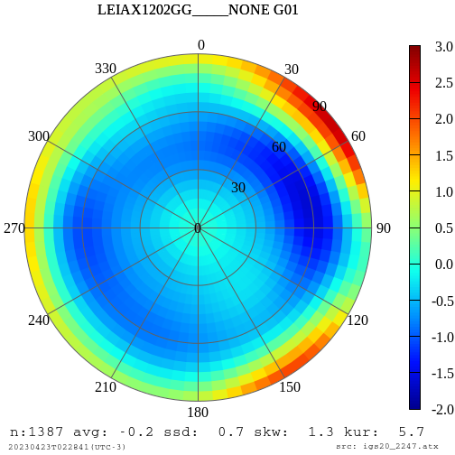
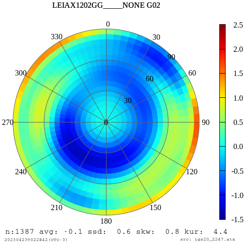
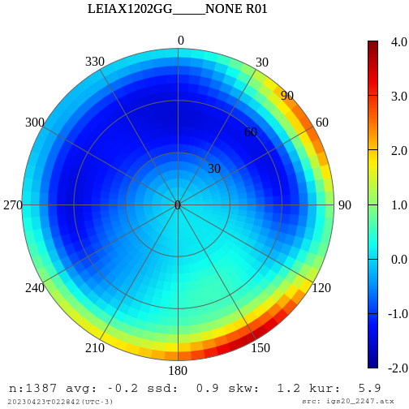
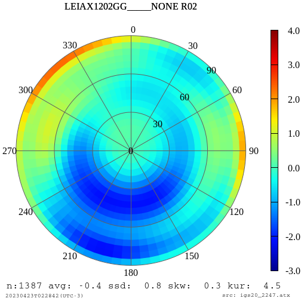
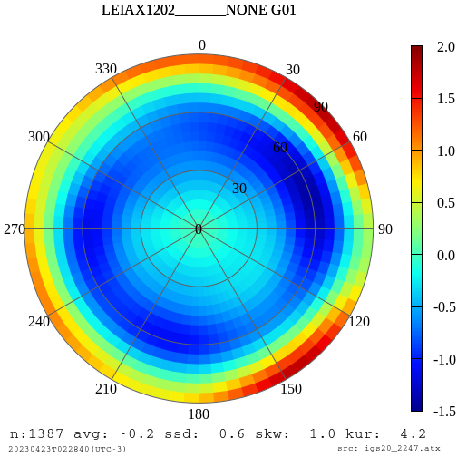
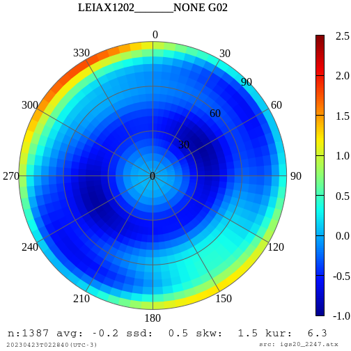
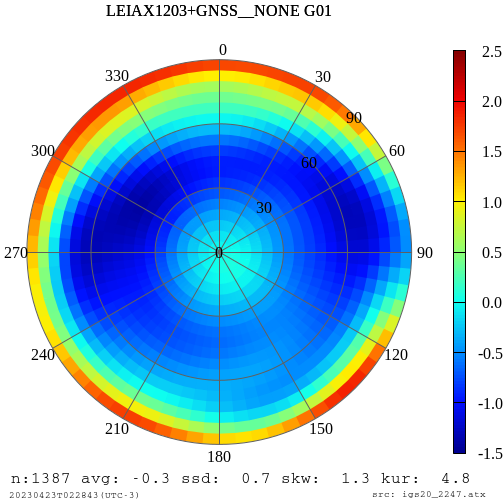
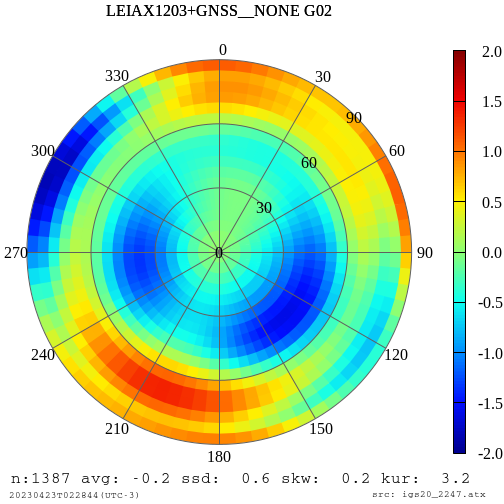
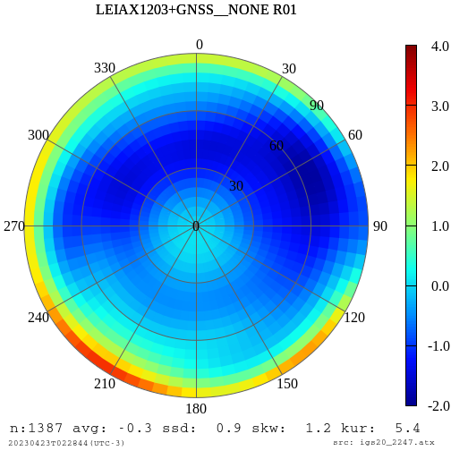
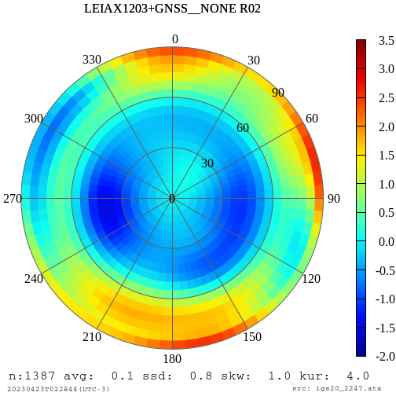

Powered by Shell Script under Linux
```
ls | grep pcv_LEIAX | awk '{printf("\n", substr($1,5,24), $1)}'
```
```
ls | grep pcv_LEIATX | awk '{printf("\n", substr($1,5,24), $1)}'
```
