Based on the ATX file igs20_2247.atx

Raw values, no interpolation applied


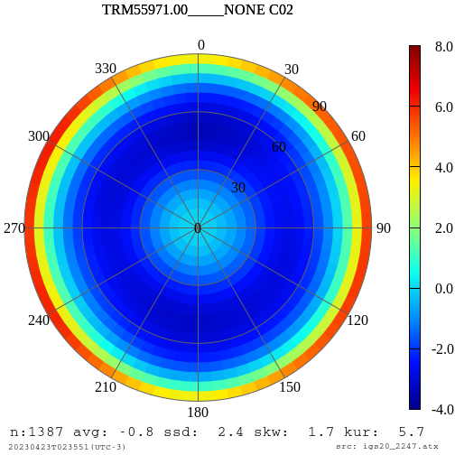
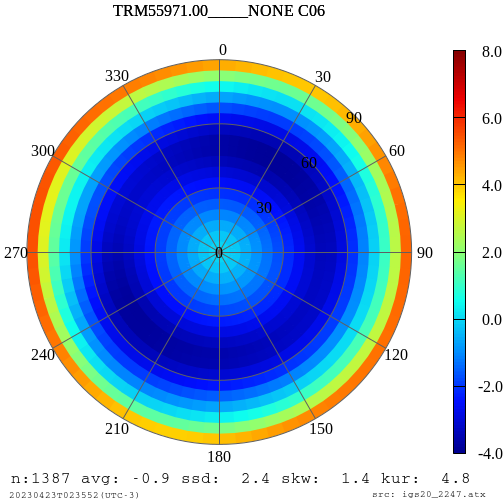
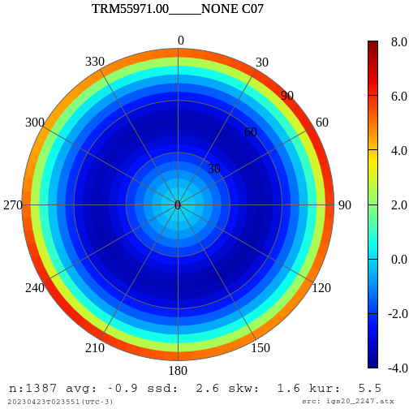
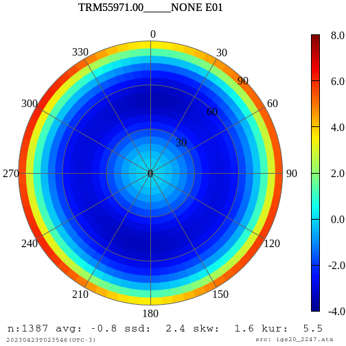


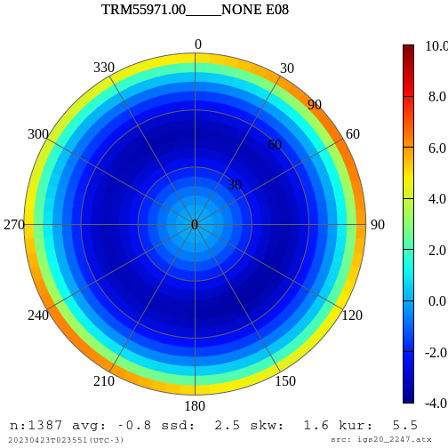

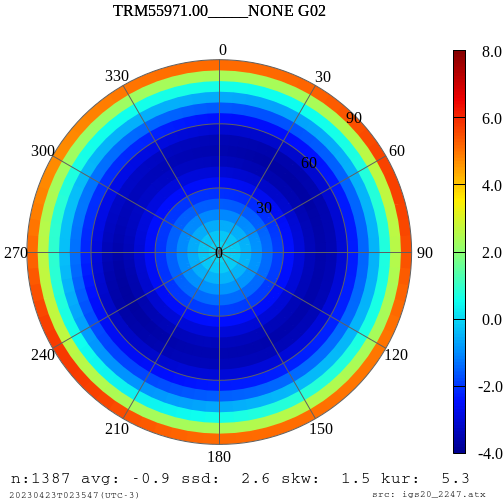

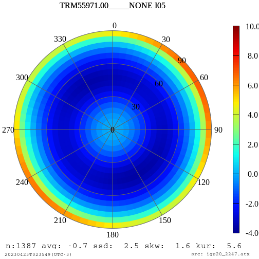


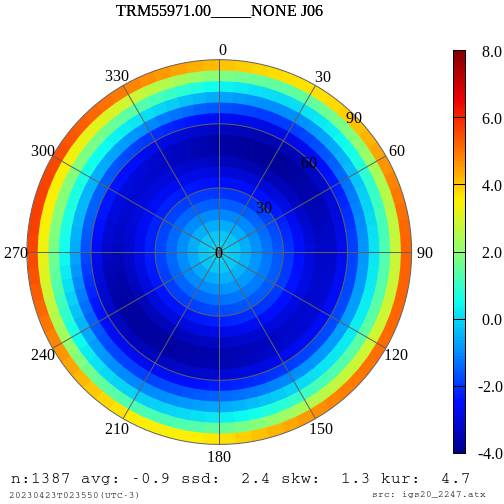
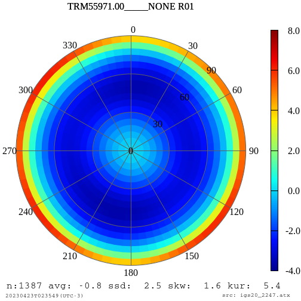


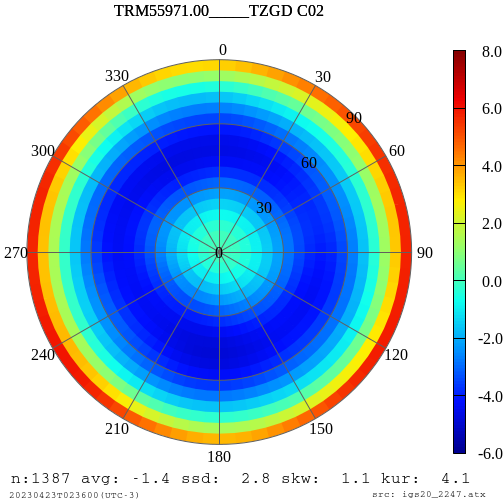
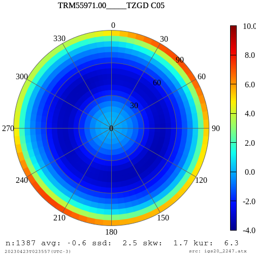
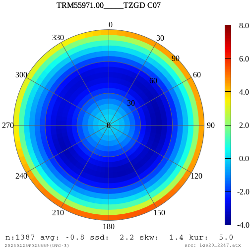
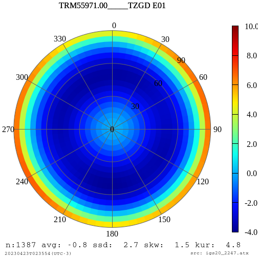

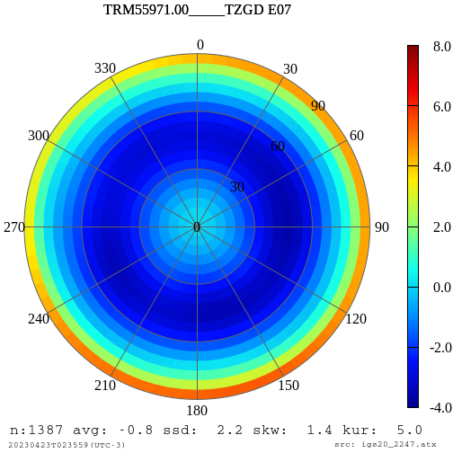

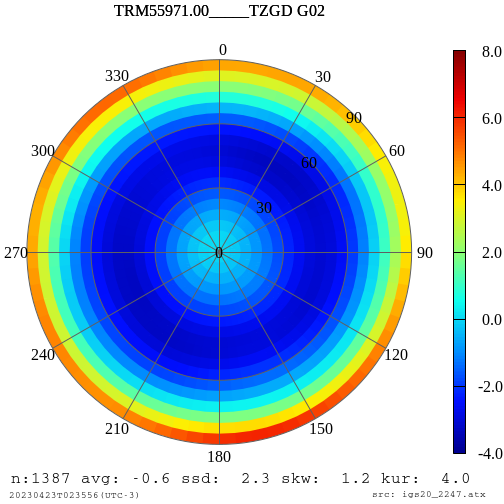


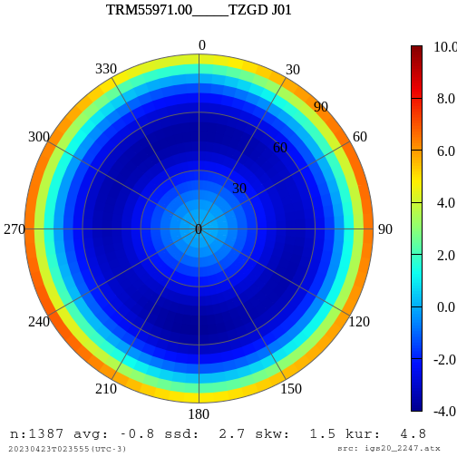


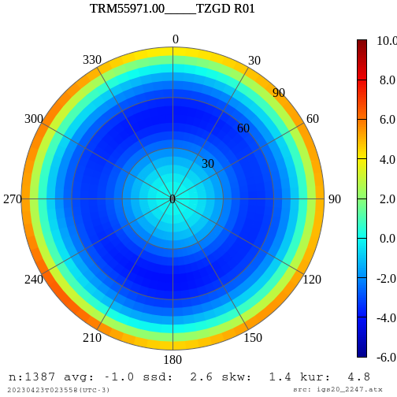
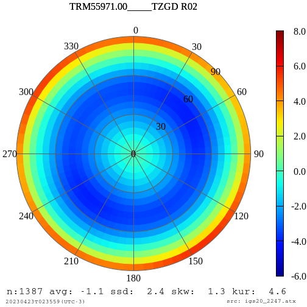
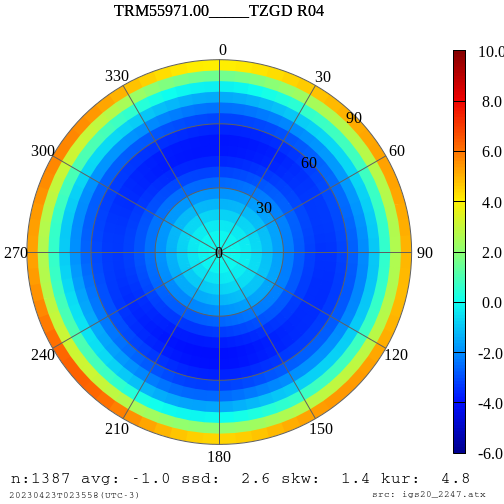
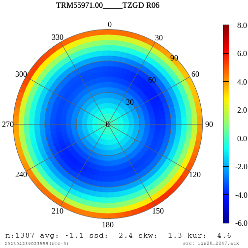


Powered by Shell Script under Linux

```ls | grep pcv_TRM55971.00 | awk '{printf("\n", substr($1,5,24), $1)}'```
